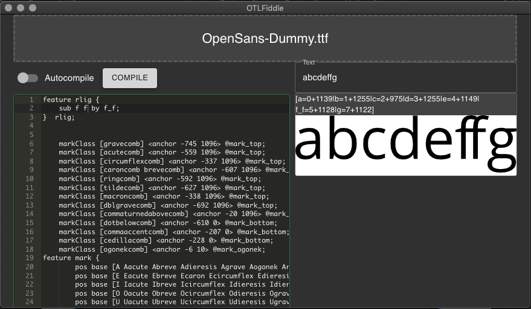
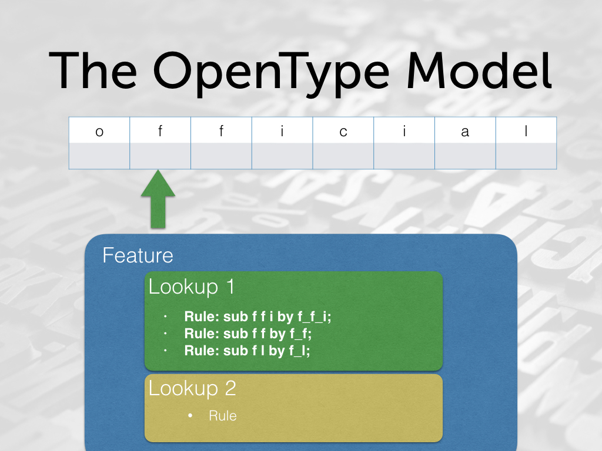
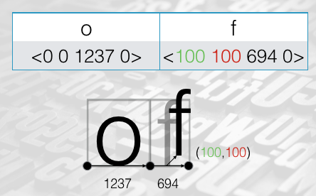

# Introduction to OpenType Programming

*Goal of this workshop*:

* To be able to write elementary layout code in Adobe feature syntax
* To understand the model and principles of OpenType shaping
* To begin to apply these principles to more advanced script requirements

You will need:

* A copy of the [OTLFiddle](https://github.com/simoncozens/otlfiddle/releases) application.

> This also requires you to have the Python “fontTools” library installed, which you can do with either “pip install fontTools” or “easy_install fontTools” from the command line if you don’t have it already.

* A copy of `OpenSans-Dummy.ttf` and `OpenSans-Dummy.fea`
* A copy of `Mirza-Dummy.ttf` and `Mirza-Dummy.fea`
* A tool like [UnicodeChecker](https://earthlingsoft.net/UnicodeChecker/), [UnicopediaPlus](https://github.com/tonton-pixel/unicopedia-plus) or a web site like [UniView](https://r12a.github.io/uniview/) which will help you to paste unfamiliar characters into text.
* [Optionally] A font editor.

Before the workshop you should:

* Download the resources above.
* Install and test OTLFiddle.
* [Optionally] Setup an Arabic keyboard on your computer.
* Have this workbook open in your PDF viewer or editor.

## Introductions

Welcome to the workshop! You can find what we’re going to be covering in the goals statement above. In this workshop we are going to be focusing more on understanding the fundamentals of how OpenType features work and how they are processed, rather than looking at specific recipes for doing specific tasks. The aim is that this will give you the tools that you need to solve your own problems in the future and that this knowledge will be transferable to more complex situations.

OpenType programming is a big area, and we cannot cover all of it in one hour! In particular, there are a few important areas which we cannot talk about today:


* creating fonts with language or script specific behavior;
* how we integrate the code that we write into our font production and mastering processes;
* how we can use OpenType layout rules to define glyph categories using the GDEF table;
* how mark positioning and anchors, normally handled by the font editor, are represented in Adobe feature syntax, and how they can be programmed.

If you want more detail on any of these areas, you might find it in my book [Fonts and Layout for Global Scripts](https://simoncozens.github.io/fonts-and-layout/).

## Basic feature coding - substitutions and ligatures

We’re mostly going to be exploring feature programming through example and experimentation. When it comes to programming, just trying things and seeing what happens is the best way to learn! OTLFiddle was created so that you can quickly test out OpenType rules and get feedback on how they are applied to a piece of text.

OpenType rules are normally written in a language that doesn't exactly have a name - it's known variously as "AFDKO" (from "Adobe Font Development Kit for OpenType"), "Adobe feature language", "fea", "feature format", and so on. Other ways of representing rules are available, (and inside the font they are stored in quite a different representation) but this is the most common way that we can write the rules to program our fonts.

We’re going to begin by coding a simple “ff” ligature. Open up OTLFiddle, drop the `OpenSans-Dummy.ttf` font at the top, and paste in the contents of into `OpenSans-Dummy.fea` the editor on the left. (This provides anchor and mark positioning rules for accents).

Then, at the top of the the editor, add the following lines:

```
feature rlig {
  sub f f by f_f;
} rlig;
```

Now hit “Compile”, and type some text in the text bar on the right. Your window should now look something like this:



* Walk through what it means.
* Point out that these are glyph names, so you need to know the glyph names in your font. f_f single ligature glyph.
* Test against text "official".

Congatulations! You’ve made your first OpenType rule. Now I would like you to *experiment* by changing the rule. We’ve successfully substituted two glyphs on the left (f f) for one glyph on the right (f_f). Can we substitute:

* One glyph for one?
* More than one glyph for one?
* One glyph for two or more?
* Two glyphs for two?
* A glyph for zero glyphs? (Can you delete a glyph?)

What about using other features rather than `rlig`? Can we substitute glyphs inside a `kern` feature?!

## Glyph Classes and Named Classes

Now let’s write a set of rules to turn lower case vowels into upper case vowels:

```
feature rlig {
  sub a by A;
  sub e by E;
  sub i by I;
  sub o by O;
  sub u by U;
} rlig;
```

That was a lot of work! Thankfully, it turns out we can write this in a more compact way:

```
feature rlig {
    sub [a e i o u] by [A E I O U];
}  rlig;
```

When a class is used in a substitution, corresponding members are substituted on both sides.

*Experiment*: What happens when a glyph class is only used on the left hand side? Try it and find out:

```
feature rlig {
    sub f [a e i o u] by f_f;
}  rlig;
```

### Named Glyph Classes

Some classes we will use more than once, and it's tedious to write them out each time. We can *define* a glyph class, naming a set of glyphs so we can use the class again later:

```
@lower_vowels = [a e i o u];
@upper_vowels = [A E I O U];
```

Now anywhere a glyph class appeared, we can use a named glyph class instead (including in the definition of other glyph classes!):

```
@vowels = [@lower_vowels @upper_vowels];

feature rlig {
  sub @lower_vowels by @upper_vowels;
} rlig;
```

## How OpenType shaping works

While we could now carry on describing the syntax of the feature file language and giving examples of OpenType rules, this would not necessarily help us to transfer our knowledge to new situations - especially when we are dealing with scripts which have more complicated requirements and expectations. To get that transferable knowledge, we need to have a deeper understanding of what we're doing and how it is being processed by the computer.

So we will now pause our experiments with substitution rules, and before we get into other kinds of rule, we need to step back to look at how the process of OpenType shaping works. *Shaping* is the application of the rules and features within a font to a piece of text. (It also includes operations like decomposition and mark reordering that we're also not going to get into today.)

We've seen that we can put *rules* into a *feature*, but it's important to know that there's another level involved too. Inside an OpenType font, rules are arranged into *lookups*, which are associated with features. Although the language we use to write OpenType code is called "feature language", the primary element of OpenType shaping is the *lookup*.

**To really understand OpenType programming, you need to think in terms of lookups, not features**.


I think of the shaping process as being like an old punched-tape computer. (If you know what a Turing machine is, that's an even better analogy.) The input glyphs that are typed by the user are written on the "tape" and then a "read head" goes over the tape cell-by-cell, checking the current lookup matches at the current position.



If it does, the shaper takes the appropriate action (substitution in the cases we have seen so far). It then moves on to the next location. Once it has gone over the whole tape and performed any actions, the next lookup gets a go (we call this "applying" the lookup).

### Explicit lookups

Let's look at our first example again:

```
feature rlig {
  sub f f by f_f;
} rlig;
```

We can see a feature, and we can see a rule, but where's the lookup? When our feature code was translated into the representation inside an OpenType font, the compiler automatically put it into a lookup for us. But we can also write our lookups explicitly, like this:

```
feature rlig {
  lookup rlig_1 {
    sub f f by f_f;
  } rlig_1;
} rlig;
```

In fact, we're going to write our rules like this from now on, and I'd encourage you to do it when you are working on your own font projects.
What difference does it make?

*Experiment*: Consider the difference between this:

```
feature rlig {
    sub a by b;
    sub b by c;
} rlig;
```

and

```
feature rlig {
    lookup l1 { sub a by b; } l1;
    lookup l2 { sub b by c; } l2;
} rlig;
```

Rules in separate lookups act in sequence, rules in a single lookup act in parallel.

### Lookup references

You can also define a lookup separately, and refer to it within a feature, like this:

```
lookup rlig_1 {
    sub f f by f_f;
} rlig_1;

feature rlig {
    lookup rlig_1;
} rlig;
```

We'll see why this is useful when we come back to chaining lookups.

### What is a feature

John Hudson described a feature as a "drawer to put lookups in"; it's an organisational tool. Features have suggested uses - the rlig feature is for required ligatures - but so long as you know what features are going to be applied in which circumstances, you have the freedom to organise your lookups as you wish.

The shaper looks at the selected features to determine which lookups to apply.

* Some lookups always selected, such as 

rlig, ccmp, locl, mark, mkmk, etc.
* Some are normally selected but the application may tell shaper to deselect them: dlig, kern, calt…
* Others are normally deselected, but the application may tell shaper to select them: ss01, smcp, c2sc, hlig, …

The features listed here are the most common, but you can find a full listing at the [Microsoft OpenType web site](https://docs.microsoft.com/en-us/typography/opentype/spec/featuretags).

### Lookup Flags

In Arabic, there is a required ligature between the letters lam and alef. We could try implementing this with a simple ligature like so:

```
feature rlig {
lookup lamalef-ligature {
    sub lam-ar alef-ar by lam_alef-ar;
} lamalef-ligature;
} rlig;
```

But this would not work in all cases because of the possibility of diacritical marks between the letters: `lam-ar kasra-ar alef-ar`. However, lookups may have flags which alter the way they operate. We can tell the lookup to ignore diacritical marks when processing.

```
feature rlig {
lookup lamalef-ligature {
    lookupFlag IgnoreMarks;
    sub lam-ar alef-ar by lam_alef-ar;
} lamalef-ligature;
} rlig;
```

*Experiment*: Let's go back to our original ligature and try it against some new text:

```
feature rlig {
  lookup ff_ligature {
    sub f f by f_f;
  } ff_ligature;
} rlig;
```

How would you make this match against the string `f̊f`? (Maybe you want to copy and paste that into OTLFiddle. It is the string "f", COMBINING RING ABOVE (Unicode codepoint U+030A), "f".)

OpenType lets us declare that some glyphs are *base* glyphs while others are *marks* - which glyphs go in which category is normally set in your font editor, although you [can also do it](http://adobe-type-tools.github.io/afdko/OpenTypeFeatureFileSpecification.html#9.b) in feature code.

Other flags you can apply to a ligature (and you can apply more than one) are:

* `RightToLeft` (Only used for cursive attachment lookups in Nastaliq fonts. You almost certainly don't need this.)
* `IgnoreBaseGlyphs`
* `IgnoreLigatures`
* `IgnoreMarks`
* `MarkAttachmentType @class` (This has been effectively superceded by the next flag; you almost certainly don't need this.)
* `UseMarkFilteringSet @class`

`UseMarkFilteringSet` ignores all marks *except* those in the specified class. This will come in useful when you are, for example, repositioning glyphs with marks above them but you don't really care too much about marks below them.

### Positioning Phase

We've talked a lot about substitution so far, but that's not the only thing we can use OpenType rules for. You will have noticed that in our "paper tape" model of OpenType shaping, we had two rows on the tape - the top row was the glyph names. What's the bottom row?

The shaper proceeds in two phases: first it applies substitution rules, which go in one part of the font, and then it applies *positioning* rules, which go in another.

In the positioning phase, the shaper associates four numbers with each glyph position. (Slide change.)

These numbers - the X position, Y position, X advance and Y advance - are called a *value record*, and describe how to draw the string of glyphs. (Slide change.)

The shaper starts by taking the advance width from metrics of each glyph. As designer, we might think of this as the width of the glyph, but when we come to OpenType programming, it's *much* better to think of this as "where to draw the *next* glyph". Similarly the "position" should be thought of as "where this glyph gets shifted." (The X advance only applies in horizontal typesetting and the Y advance only applies in vertical typesetting.)

In feature syntax, these value records are denoted as four numbers between angle brackets.



As well as writing rules to *substitute* glyphs in the glyph stream, we can also write *positioning* rules to adjust these value records by adding a value to it. Let's write one now!

*Experiment*: Remove the features you have added in OTLFiddle, and paste in this one:

```
feature kern {
    lookup adjust_f {
        pos f <0 0 200 0>;
    } adjust_f;
} kern;
```

 * Try it on text like `afbffc`. What did it do?
 * Play about with each of the components of the value record. How do they affect the output?
 * What about *negative* values?
 * Try to turn the "f" into an "accent" - with no width of its own, positioned on top of the letter before it. What happens if you type two f's in a row? (Can you work out why?)

### Types of rule

We've seen a variety of substitution rules, as well as a positioning rule. Are there any other kinds of positioning rule? Are there any other rules? As it happens, the whole set of rule types we need to know about are:

* Substitution
    * One to one
    * Many to one (ligature)
    * One to many
    * Reverse chaining (Only used for Nastaliq fonts)
* Positioning
    * Single positioning: `pos glyph <…>;`
    * Pair positioning: `pos glyph1 <…> glyph2;`
* Anchor
* Chain

Some *questions*:

* Why isn't there a many to many substitution rule? (Hint: `IgnoreMarks`.)
* Why do you think a pair positioning rule might be useful?

*Anchor* rules (of which there are four kinds: cursive attachment, mark positioning, mark-to-mark and mark-to-ligature attachment) are for sticking a glyph onto another glyph. Again, unfortunately we don't have time to get into them today.

*Chain* rules, however, are a lot of fun. So far all of the rules we have seen apply in all situations. Chaining rules are the equivalent of an `if` statement; they allow us to apply rules in certain circumstances.

## Chain rules

*Example 1*: In Urdu the `yehbarree-ar.fina` glyph "goes backwards" with a large negative right sidebearing, and if not handled carefully can bump into glyphs behind it. When `threedotsdownbelow-ar` occurs before a `yehbarre-ar.fina`, we want to insert an `extender` glyph.

First we create a lookup which explains *what* we want to do:

```
lookup add_extender_before {
   sub yehbarree-ar.fina by extender yehbarree-ar.fina;
} add_extender_before;
```

Next we create a feature which explains *when* we want to do it:

```
feature rlig {
lookup bari_ye_collision {
   sub threedotsdownbelow-ar yehbarree-ar.fina' lookup add_extender_before;
} bari_ye_collision;
} rlig;
```


*Experiment*: Paste this into OTLFiddle:

```
lookup ff_ligature {
    sub f f by f_f;
} ff_ligature;

feature rlig {
    sub [A E I O U] f' lookup ff_ligature;
} rlig;
```

Now try it on the string `Off off`. What happens? Why?

A chain rule has three parts, two of which are optional: an optional *backtrack* (also known as *precontext*), the (mandatory) *input*, and the optional *lookahead* (also known as *postcontext*). The input sequence (marked with apostrophe `'` characters) also contains a list of lookups to run at each position if the backtrack, input and postcontext sequences match the glyph stream.

Some notes on chain rules:

* Chains which call substitution lookups must start `sub`. Chains which call position lookups must start `pos`.
* You can chain into lookups containing chains (into lookups containing chains…)!
* You can chain zero, one or (with recent versions of fontTools/makeotf) multiple lookups at each input glyph position:

```
sub [A E I O U]
    f' lookup ff_ligature lookup uppercase # Two lookups
    @lowercase'
    [a e i o u]' lookup uppercase
;
```

* There are “inline” forms of chain rules where you specify the rule to chain on the same line, not as a separate lookup:

```


pos @medial @mark_above SHADDA’ <-30 100 0 0>;
```

* They will mess you up. Don’t use them.

## Close-out

Thank you for attending the workshop. This is the first time it has been run, so please let me know of any feedback you have. I hope it has been useful for you.
